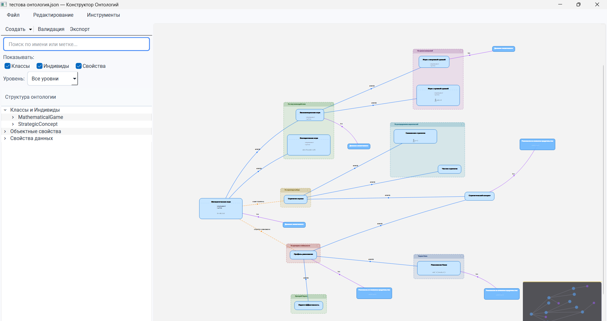

# Конструктор Онтологий

Графический редактор онтологий, разработанный в рамках дипломной работы «Иерархические структуры процессов разработки онтологий» (КубГУ, факультет компьютерных технологий и прикладной математики).

Приложение позволяет визуально создавать и редактировать онтологии в формате OWL, работая с классами, индивидами, объектными и атрибутивными свойствами через интерактивный граф.

---

## Возможности

**Редактирование онтологии**
- Создание и редактирование классов, индивидов, объектных и атрибутивных свойств
- Визуальное связывание элементов на интерактивном графе
- Иерархическое наследование классов с поддержкой расширений (extensions)
- Значения атрибутов отображаются прямо на узлах графа

**Визуализация**
- LOD-рендеринг: автоматическое упрощение отрисовки при отдалении камеры
- Подсветка пути между двумя выбранными узлами (BFS по всем типам рёбер)
- Мини-карта для навигации по большим онтологиям
- Автодополнение в поиске с центрированием на найденном узле
- Сворачивание/разворачивание ветвей иерархии

**Формулы**
- Встроенный редактор формул (LaTeX / SymPy) с рендерингом прямо на узлах
- Вычисление символьных выражений через SymPy

**Сохранение и экспорт**
- Форматы: OWL (RDF/XML), Turtle, JSON (внутренний формат)
- Сохранение позиций узлов в `.layout.json` сайдкарах
- Undo/Redo через Command-паттерн

**Интерфейс**
- Дерево объектов с фильтрацией, поиском и контекстным меню
- Синхронизация выбора между деревом и графом (включая подсветку пути)
- Кастомный QSS-стиль

---

## Стек

| Компонент | Технология |
|---|---|
| GUI | PySide6 (Qt for Python) |
| Онтологии | Owlready2 |
| Формулы | SymPy, matplotlib (SVG-рендер) |
| Сборка | PyInstaller |
| Python | 3.11+ |

---

## Установка и запуск

**Клонировать репозиторий:**
```bash
git clone https://github.com/ShinMothra/Final-Qualifying-Work-Ontologies.git
cd ontology-constructor
```

**Установить зависимости:**
```bash
pip install -r requirements.txt
```

**Запустить:**
```bash
python main.py
```

---

## Сборка .exe (Windows)

```bash
pip install pyinstaller
pyinstaller konstruktor_ontologiy.spec
```

Готовое приложение появится в `dist/КонструкторОнтологий/`. Для переноса на другой компьютер копируется вся папка целиком.

---

## Структура проекта

```
├── main.py                   # Точка входа
├── konstruktor_ontologiy.spec
├── requirements.txt
├── resources/
│   ├── style.qss
│   ├── icons/
│   └── Roboto-Regular.ttf
├── gui/
│   ├── main_window.py
│   ├── start_page.py
│   ├── canvas/               # Графическая сцена, узлы, рёбра, мини-карта
│   ├── dialogs/              # Диалоги создания/редактирования элементов
│   ├── sidebar/
│   └── toolbox/
├── core/
│   ├── model/                # Модель онтологии (OntologyManager, элементы)
│   ├── storage/              # Загрузка/сохранение OWL и JSON
│   ├── history.py            # HistoryManager (undo/redo)
│   └── commands.py           # Command-паттерн
└── modules/
    ├── editor_module/
    ├── formula_module/       # Редактор и рендерер формул
    ├── export_module/
    └── validation_module/
```

---

## Скриншоты

**Главное окно редактора с загруженной онтологией**


**Граф онтологии**


**Подсветка пути между узлами**


**Дерево объектов и боковая панель**


**Редактор формул**


---

## Автор

Разработано в рамках выпускной квалификационной работы, КубГУ, 2025.
